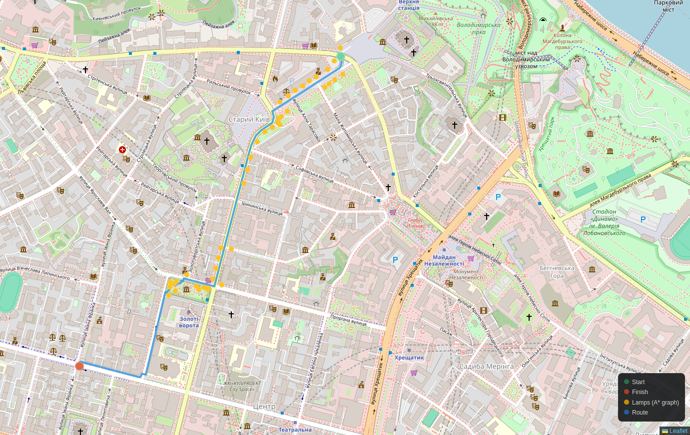

# SvitloNav

<p align="center">


<br>


</p>


SvitloNav is a pedestrian routing system that generates walking routes through illuminated streets using OpenStreetMap streetlight data. It combines PostgreSQL/PostGIS for spatial queries and Valhalla as the routing engine to prefer well-lit roads whenever possible.


<p align="center">
<a href="[https://your-demo-link](https://make-kyiv-great-again.github.io/svitlonav/demovid.mp4)">

</a>
</p>

## Features

- Pedestrian routing with streetlight preference
- OpenStreetMap streetlight import
- Spatial queries using PostGIS
- Valhalla routing engine
- Interactive map visualization
- Docker-based development environment

---

# How It Works

SvitloNav separates route computation from spatial analysis.

For each routing request:

1. The client sends origin and destination coordinates.
2. The API requests a pedestrian route from Valhalla.
3. Valhalla computes the route using its routing algorithms while taking the `use_lit` pedestrian costing parameter into account.
4. The resulting route geometry is returned to the API.
5. PostGIS queries all streetlights located near the computed route.
6. The API returns both the route geometry and nearby streetlights for visualization.

Valhalla internally uses graph-search algorithms (including A*-based routing and hierarchical routing optimizations) to efficiently compute routes over the road network. SvitloNav relies on Valhalla's routing engine while PostGIS provides spatial analysis and streetlight lookup.

---

# Requirements

- Go 1.24+
- Docker
- Docker Compose
- GNU Make

---

# Getting Started

## Clone the repository

```bash
git clone https://github.com/Make-Kyiv-Great-Again/svitlonav.git
cd svitlonav
```

## Download OSM datasets

The repository does not include OSM extracts due to their size.

Download both datasets:

[Proton Drive](https://drive.proton.me/urls/17Y9VEKE8G#Qm7V6vIdlhHg)

Place the files as follows:

```
svitlonav/
├── lamps.osm.pbf
├── cmd/
├── internal/
├── migrations/
├── valhalla_data/
│   └── kyiv_lit.osm.pbf
└── ...
```

| File | Location | Purpose |
|------|----------|---------|
| `lamps.osm.pbf` | Project root | Streetlight import |
| `kyiv_lit.osm.pbf` | `valhalla_data/` | Valhalla graph generation |

---

# Start Infrastructure

Launch PostgreSQL, PostGIS, Valhalla and all required services.

```bash
make infra-up
```

If `kyiv_lit.osm.pbf` has been replaced or updated, rebuild the routing tiles:

```bash
make infra-down
make infra-up
```

---

# Import Streetlights

Import streetlights into the database.

```bash
go run cmd/import-lamps/main.go
```

The importer expects:

```
./lamps.osm.pbf
```

to exist in the project root.

---

# Build Valhalla Graphs

Generate routing tiles from the OSM dataset.

```bash
go run cmd/build-graphs/main.go
```

The builder expects:

```
./valhalla_data/kyiv_lit.osm.pbf
```

---

# Run the API

Start the backend server.

```bash
go run cmd/api/main.go
```

Configuration is loaded from `.env`.

After the server starts, the API and web interface will be available at the port specified in `.env`. By default, it listens on:

```text
http://localhost:8080
```

---

# Development Workflow

Typical setup:

```bash
git clone https://github.com/Make-Kyiv-Great-Again/svitlonav.git
cd svitlonav

# Download datasets
# lamps.osm.pbf -> project root
# kyiv_lit.osm.pbf -> valhalla_data/

make infra-up

go run cmd/import-lamps/main.go
go run cmd/build-graphs/main.go

go run cmd/api/main.go
```

Rebuilding routing graphs is only necessary after updating `kyiv_lit.osm.pbf`.

Re-importing streetlights is only necessary after updating `lamps.osm.pbf`.

---

# Project Structure

```
cmd/
├── api/
├── build-graphs/
└── import-lamps/

internal/
├── database/
├── repository/
├── service/
├── valhalla/
├── pathfinding/
└── ...

migrations/

valhalla_data/
└── kyiv_lit.osm.pbf
```

---

# Technology Stack

- Go
- PostgreSQL
- PostGIS
- Valhalla
- OpenStreetMap
- Docker Compose

---

# Project Status

The current implementation builds pedestrian routes using Valhalla with OpenStreetMap streetlight data and returns nearby streetlights for visualization on the client.
